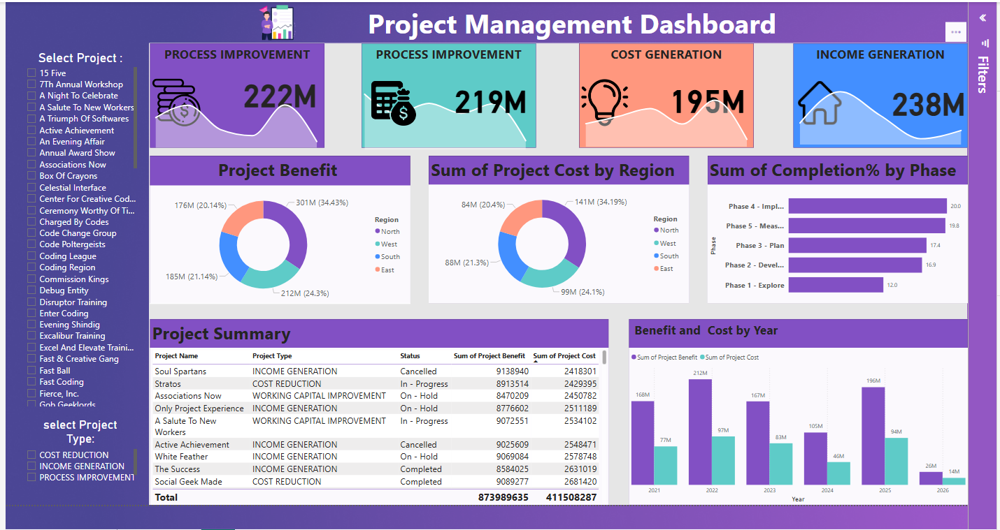

# 🚀 Power BI Project Management Dashboard

## 📌 Overview

This interactive **Project Management Dashboard** was developed using **Power BI** to track and visualize key metrics across multiple projects. It helps teams monitor project cost, benefit, performance, and completion across time, regions, and types.

---

## 🎯 Features

- 📁 **Project Filters**: Easily filter by project name, type, or status.
- 🌍 **Regional Breakdown**: Costs and benefits split by North, East, South, and West.
- 🕒 **Project Timeline**: Completion progress shown by phase and year.
- 📈 **KPIs Included**:
  - Total Process Improvement: **222M**
  - Total Cost Generation: **195M**
  - Total Income Generation: **238M**
  - Project Benefit vs Cost
  - Completion % by Project Phase

---

## 📊 Visuals & Charts

- 🧮 **KPI Cards**: Total Sales, Profit, Discount, Quantity
- 🥧 **Donut Charts**: 
  - Total Benefit by Region
  - Total Cost by Region
- 📊 **Bar Charts**:
  - Completion % by Phase
  - Benefit and Cost by Year
- 📋 **Project Summary Table**:
  - Name, Type, Status, Benefit, Cost

---

## 🧠 Insights

- **Income Generation Projects** had the highest contribution (238M).
- Most resources are focused on **West** and **North** regions.
- **Phase 4 (Implementation)** showed highest completion %.
- Year **2022** and **2025** had peak benefits and investments.

---

## 🖼️ Screenshot

> Below is a preview of the interactive dashboard:

---

## 📂 Requirements

- 📎 Tool: Microsoft Power BI Desktop
- ✅ No external data source required
- 🔒 Fully offline & secure

---

## 🛠️ How to Use

1. Open the `.pbix` file in Power BI Desktop.
2. Use slicers on the left to filter by:
   - Project name
   - Region
   - Quarter / Year
   - Project Type
3. Interact with visuals to explore project metrics dynamically.

---

## 🤝 Contribution

Want to improve it?
- Fork the repo
- Add your custom visuals or metrics
- Submit a pull request

---

## 📬 Contact

For feedback or inquiries, please reach out through GitHub Issues or Discussions.

